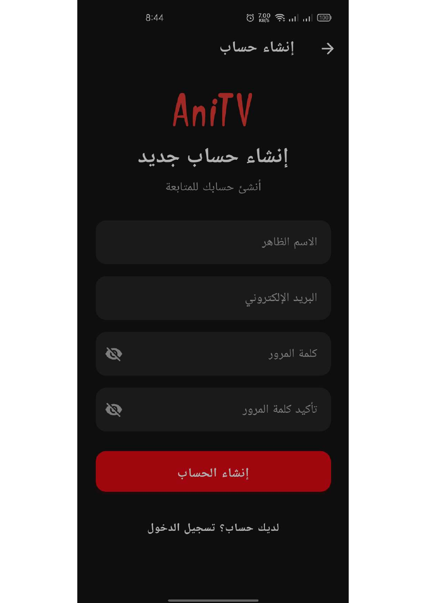
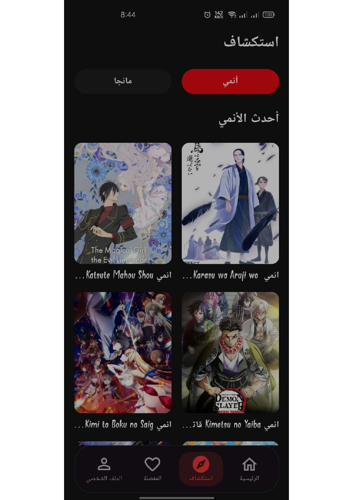
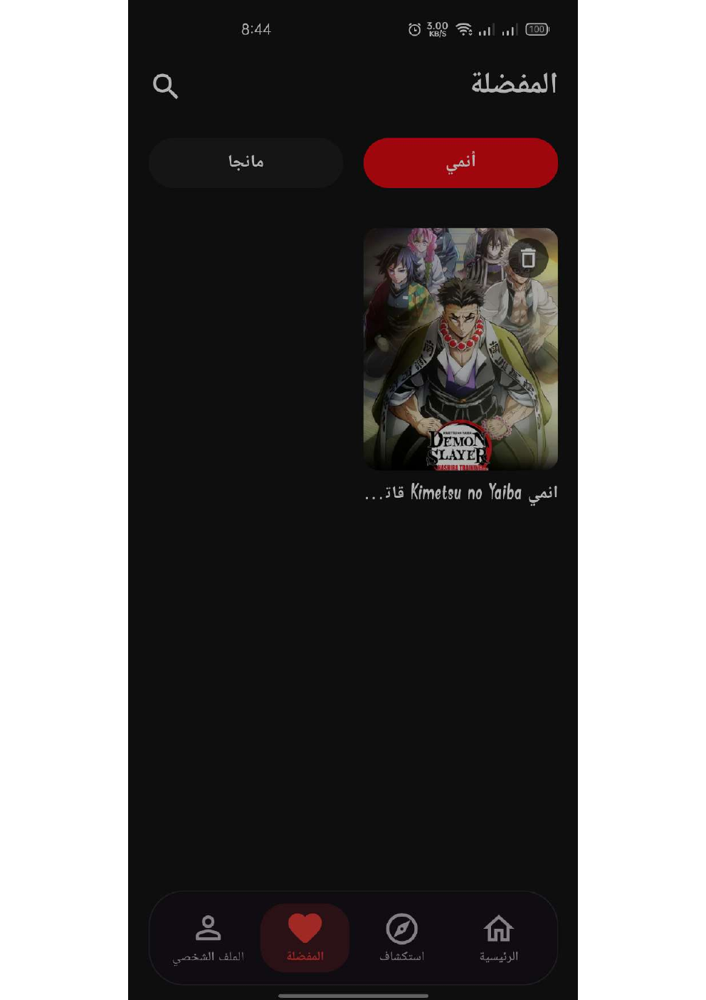
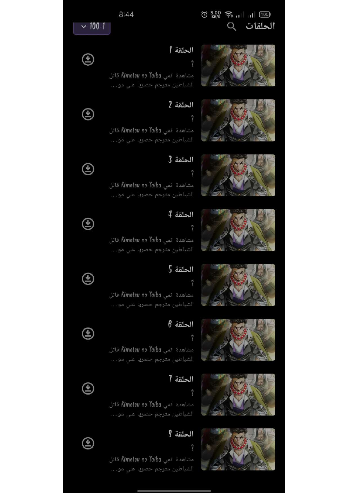

#  AniTV

تطبيق Android مبني باستخدام Flutter لمشاهدة الأنمي وقراءة المانجا والقصص المصورة في تجربة عربية بسيطة، مع دعم المفضلة والسجل والتنزيلات ومشغل الفيديو وتسجيل الحسابات.

## الهوية

- **اسم التطبيق:** AniTV
- **المنصة:** Android
- **معرّف الحزمة:** `com.anitv.app`
- **اللغة واتجاه العرض:** العربية مع RTL
- **الإصدار الحالي:** `1.2.1`
- **Version Code:** `2`
- **الحد الأدنى لإصدار Android:** Android 5.0 (API 21)
- **Target SDK:** 34
- **Compile SDK:** 34

## المميزات

- تصفح مصادر الأنمي والمانجا المتاحة داخل التطبيق.
- البحث عن المحتوى وعرض تفاصيل الأنمي والمانجا.
- تشغيل حلقات الفيديو داخل مشغل التطبيق عند توفر المصدر.
- قراءة الفصول باستخدام قارئ الصور.
- إضافة الأنمي والمانجا إلى المفضلة.
- حفظ سجل المشاهدة والقراءة.
- تنزيل الحلقات والفصول للاستخدام المحلي.
- تسجيل الحساب بالبريد الإلكتروني وكلمة المرور.
- استعادة كلمة المرور عبر البريد الإلكتروني.
- مشاركة روابط AniTV الرسمية وفتح المحتوى داخل التطبيق عند توفره.
- صفحة About تعرض الإصدار وVersion Code وتوافق Android.
- فحص آخر إصدار من GitHub Releases.
- واجهة عربية ودعم الوضع الداكن.

## التحميل

يتوفر أحدث ملف APK عبر [GitHub Releases](https://github.com/lo-oord/Ani-TV/releases) أو من خلال [موقع AniTV الرسمي](https://anitv-manga-lord.vercel.app/download).

## الخصوصية

يمكن قراءة [سياسة الخصوصية الرسمية](https://anitv-manga-lord.vercel.app/privacy) لمعرفة كيفية التعامل مع بيانات الحساب والمفضلة والسجل والتنزيلات وخدمات الطرف الثالث.

## Screenshots

هذه لقطات حقيقية من تطبيق AniTV:

| إنشاء حساب | الصفحة الرئيسية |
| --- | --- |
|  |  |

| الاستكشاف | المفضلة |
| --- | --- |
|  |  |

| قائمة الحلقات |
| --- |
|  |

## البناء والاختبار

لا يتم اعتماد بناء APK نهائي محليًا. يتم تنفيذ التحليل والاختبارات وبناء Android عبر GitHub Actions باستخدام الملف `.github/workflows/android.yml`.

لتشغيل التحقق محليًا عند توفر Flutter:

```bash
flutter pub get
flutter analyze --no-fatal-infos --no-fatal-warnings
flutter test
```

## إعداد Android

يستخدم المشروع الإعدادات الحالية التالية:

- `applicationId`: `com.anitv.app`
- `minSdk`: `21`
- `targetSdk`: `34`
- `compileSdk`: `34`
- الإصدار: `1.2.1+2`

## المصادر

يحافظ AniTV على مصادر المحتوى الحالية المضمّنة في المشروع، ولا يغيّرها الموقع الرسمي أو نظام المشاركة والتحديثات.

## المستودع

[lo-oord/Ani-TV على GitHub](https://github.com/lo-oord/Ani-TV)
